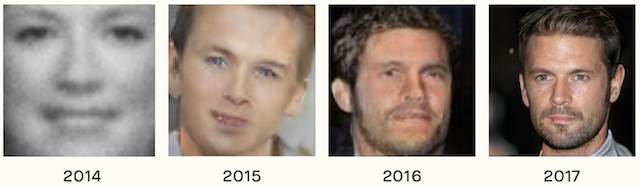

# Cine MRI Cardiac Cycles Generation using Deep Learning techniques

## Motivation
Cardiovascular diseases are the number 1 cause of death globally according to the World Health Organization (https://www.who.int/health-topics/cardiovascular-diseases/). Early detection, monitoring, and quantification of cardiac alterations are essential for an effective treatment. Cine-MRI sequences are ideal medical sequences used by experts to produce a diagnosis due to the information they give about the cardiac cycle, morphology, and physiology of the walls of the heart. With Machine learning methods, we can remove subjectivity in terms of an expert dependency and support tasks like segmentation and quantification of cardiac patterns. However, these methods require lots of data which are difficult to find in areas such as medicine.

## Dataset
Data is a key thing when working with Neural Networks. Deep learning algorithms have many parameters that need to be tuned and therefore need a lot of data in order to come up with somewhat generalizable models. Therefore we need to choose an appropiate set of data for our task.

### Sunnybrook Cardiac Data (SCD)

Also known as the 2009 Cardiac MR Left Ventricle Segmentation Challenge data, consist of 45 cine-MRI images from a mixed of patients and pathologies.

<p align="center">
  
</p>

- Image Dimensions: 256x256x3
- 4 Pathologies: healthy, hypertrophy, heart failure with infarction and heart failure without infarction.

## Objective
To develop a generative model that produces synthetic cine-MRI sequences, to augment an existing dataset for strengthening the process of training on machine learning models.

## What's been proposed?
Augmenting the existing data let machine learning methods achieve better generalization on a vast number of tasks. We have to take in mind that augmented samples have to supply new features to guide the model during the training to a more robust version of itself and not pay attention to irrelevant things e.g an upside down image of a heart.

### Affine transformations
Applying affine transformations is a common technique due to their ease of applicability. Nevertheless, the generated samples do not supply the model with new features and sometimes misleads the model training.

<p align="center">
  
</p>

### Photometric transformations
Applying photometric transformations change the color space of a particular image by changing luminosity, etc. These transformations preserve geometry but very few of them can be applied in the medical imaging area.

<p align="center">
  
</p>

### Generative Adversarial Networks
Usually known as GANs, the generative adversarial network framework consist of two neural networks; A network $G$ capable of generating images close enough to a data distribution and $D$ whose task is to discriminate between real and generated samples while leading $G$ to produce better looking images. These generative models allow to produce new images from a data distribution without explicitly modeling the probability density function of data.

<p align="center">
  
</p>

Proper application of GANs could lead to successful generative modeling that provides an alternative and potentially more domain-specific approach for data augmentation. Perhaps the most compelling reason that GANs are widely studied, developed, and used is because of their success. GANs have been able to generate photos so realistic that humans are unable to tell that they are of objects, scenes, and people that do not exist in real life. Below you will see a timeline and how well GANs produced samples in the respective year.

<p align="center">
  
</p>

# Using Generative Adversarial Networks to augment cine-MRI cardiac cycles dataset
Inside this repository you will find some useful tools like jupyter notebooks or python scripts to help you understand how to handle the SunnyBrook dataset and develop every proposed approach. For simplicity, we will use Keras Deep Learning library and Tensorflow as the backend.

## Implementing a DCGAN with GANHacks suggestions for stable training and fast convergence

### 128x128 Cine-MRI images
Let's start simple and code an unconditional Deep Convolutional Generative Adversarial Networks that samples random noise to images. We will do the implementation and data preprocessing in the notebook located in the ```notebooks``` folder called [Keras - 2.5D - 128 - Deep Convolutional GAN.ipynb](https://github.com/Sangohe/CV-cineMRI_cardiacCycles_generation/blob/master/notebooks/Keras%20-%202.5D%20-%20128%20-%20Deep%20Convolutional%20GAN.ipynb) or if you prefer, you can take a look at the notebook in [Google Colaboratory](https://colab.research.google.com/drive/1SCJ50ykLpFYqv208E_BjhD0LzPd-TMDa). The images used in the notebook are downscaled to 128x128x1 pixels and concatenated in the channels dimension to get a cardiac cycle with dimensions 128x128x20. 

#### Generated Samples
<p align="center">
  
</p>

We can see that our first approach generated very noise samples but succeded to learn the more general features of cine-MRI like the black contour and basic structure of the heart. We researched a little and found that earlier architectures of GANs like DCGAN struggles with mode collapse and generating relatively medium size images. Our main objective is for GANs to learn well the heart structure and in order to achieve that, we will crop the magnetic resonance images and downscale them to 64x64 to remove information that is not valuable.

### 64x64 Cine-MRI images
Our second approach consists in cropping the original 256x256 images to get a new image with just the right and left ventricle. We will do the implementation and data preprocessing in the notebook located in the ```notebooks``` folder called [Keras - 2.5D - 64 - Deep Convolutional GAN.ipynb](https://github.com/Sangohe/CV-cineMRI_cardiacCycles_generation/blob/master/notebooks/Keras%20-%202.5D%20-%2064%20-%20Deep%20Convolutional%20GAN.ipynb) or if you prefer, you can take a look at the notebook in [Google Colaboratory](https://colab.research.google.com/drive/1cH2yXoBACe-cnXFb77eJDHznI4xAQHYi#scrollTo=l8jiAlpshFE7). The images used in the notebook are downscaled to 64x64x1 pixels and concatenated in the channels dimension to get a cardiac cycle with dimensions 64x64x20. 

#### Generated Samples
<p align="center">
  
</p>

One more time we see that our generated samples are very but they keep general features of the training image set like the left and right ventricle shape. Resolution is very important in assesing cardiac cycles, so we have to figure out a way to produce better looking images while keeping the good things we already have like the general structure of the heart.

### Progressive Growing Generative Adversarial Networks
While searching for tips to improve the image quality of the generated samples, we found a paper called [Progressive Growing of GANs for Improved Quality, Stability, and Variation](https://arxiv.org/pdf/1710.10196.pdf) that proposes a novel architecture for improving the image quality and variation and the training stability. Karras et al. leaves aside the concept of fixed layer for the discriminator and generator models for progressive growing models that speed up training time, improve the overall image quality and variation and also allow us to produce more challenging samples i.e more resolution.

#### Discriminator and Generator framework
The key innovation of the Progressive Growing GAN is the incremental increase in the size of images output by the generator, starting with a 4×4 pixel image and doubling to 8×8, 16×16, and so on until the desired output resolution.

This is achieved by a training procedure that involves periods of fine-tuning the model with a given output resolution, and periods of slowly phasing in a new model with a larger resolution. All layers remain trainable during the training process, including existing layers when new layers are added.

Progressive Growing GAN involves using a generator and discriminator model with the same general structure and starting with very small images. During training, new blocks of convolutional layers are systematically added to both the generator model and the discriminator models.

<p align="center">
  
</p>

The incremental addition of the layers allows the models to effectively learn coarse-level detail and later learn ever-finer detail, both on the generator and discriminator sides. This incremental nature allows the training to first discover large-scale structure of the image distribution and then shift attention to increasingly finer-scale detail, instead of having to learn all scales simultaneously.

Additional to the new way of training, authors propose the following techniques:

- **Minibatch Standard Deviation**: Mini-batch discrimination concatenates an extra feature map onto the discriminator that is made of the feature statistics across all images in a batch. This pushes the batch of generated samples to share similar features to the batch of real samples, otherwise the mini-batch feature layer will easily expose the generated samples as being fake. Progressively-Growing adds a simpler, constant feature map. This constant feature map is derived from the standard deviation of all features in a batch across spatial locations. This final constant map is similarly inserted towards the end of the discriminator.

- **Equalized Learning Rate:** The idea behind equalized learning rate is to scale the weights at each layer with a constant such that the updated weight w’ is scaled to be w’ = w /c, where c is a constant at each layer. This is done during training to keep the weights in the network at a similar scale during training. This approach is unique because usually modern optimizers such as RMSProp and Adam use the standard deviation of the gradient to normalize it. This is problematic in the case where the weight is very large or small, in which case the standard deviation is an insufficient normalizer.

- **Pixel Normalization:** Scales the inputs by the L2 norm
